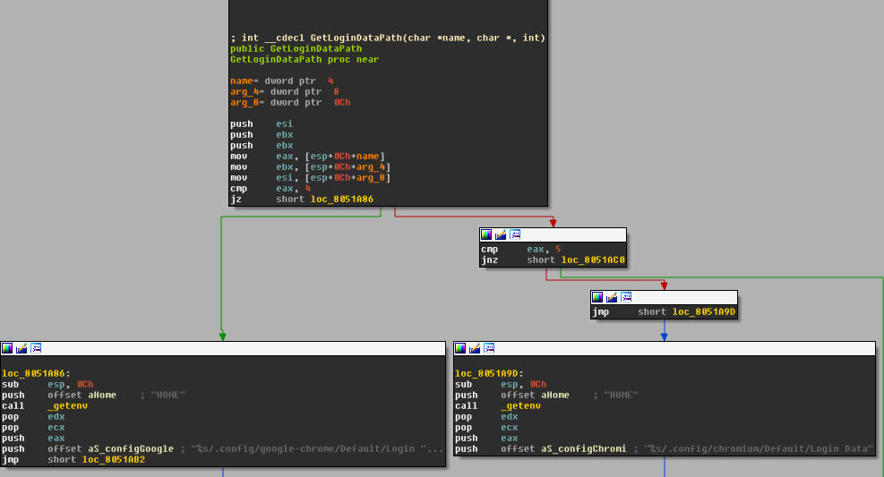

# Wirenet

Decompiling the 2012 Linux malware.
The code is part of my thesis: it is a proof of concept of
the various functionalities found in the sample.

<!--# 
# 
# 
# * Summary of the analysis: Key takeaways should the reader get from the report regarding the specimen’s nature, origin, capabilities, and other relevant characteristics
# * Identification: The type of the file, its name, size, hashes (such as MD5, SHA1, and ssdeep), malware names (if known), current anti-virus detection capabilities
# <!-- ### md5: 9a0e765eecc5433af3dc726206ecc56e
# * Characteristics: The specimen’s capabilities for infecting files, self-preservation, spreading, leaking data, interacting with the attacker, and so on
# * Dependencies: Files and network resources related to the specimen’s functionality, such as supported OS versions and required initialization files, custom DLLs, executables, URLs, and scripts
# * Behavioral and code analysis findings: Overview of the analyst’s behavioral, as well as static and dynamic code analysis observations
# * Supporting figures: Logs, screenshots, string excerpts, function listings, and other exhibits that support the investigators analysis
# Incident recommendations: Indicators for detecting the specimen on other systems and networks (a.k.a. “indicators of compromise”), and possible for eradication steps 
-->
